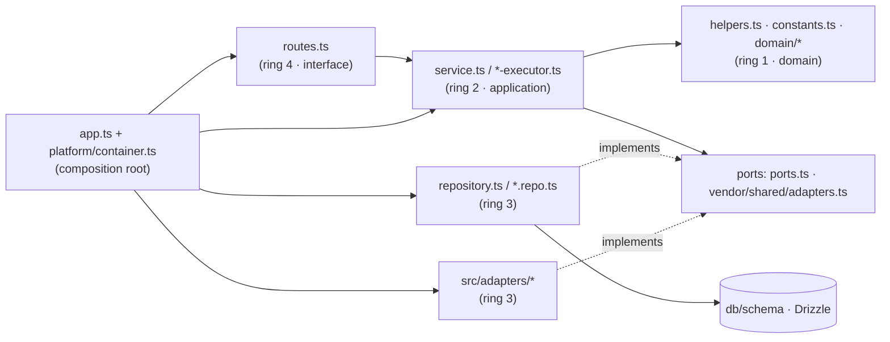

# Layers: placement map and allowed imports

Read this when you add a file to `server/src` or `reviewer-core/src` and aren't sure which ring it belongs to, or when an import feels wrong.

## Contents
1. The rings, drawn
2. Placement map: what I'm adding → where it goes
3. Allowed-imports matrix
4. Files that aren't classified yet
5. Decision rules for ambiguous cases

## 1. The rings, drawn

Solid arrows are imports. Dotted arrows mean "implements". Ring 3 points **at** the ports owned by the inner rings. That inversion is the whole point (Palermo part 1, Cockburn).

## 2. Placement map

| What I'm adding | Ring | Where |
|---|---|---|
| New HTTP endpoint | 4 | `modules/<m>/routes.ts`: route `schema` (zod), `getContext`, one service call |
| Business rule, calculation, state transition, scoring | 1 | `modules/<m>/helpers.ts` (pure function) or `modules/<m>/domain/<rule>.ts` once there are several |
| Literals, enums, job kinds | 1 | `modules/<m>/constants.ts` (`UPPER_SNAKE`, `as const`) |
| Use case ("add repo", "start review run") | 2 | Method on `modules/<m>/service.ts`; long pipelines in `<name>-executor.ts` |
| Repository interface (port) | 2 | `modules/<m>/ports.ts` (`export interface RepoStore { … }`) |
| SQL / Drizzle query, row→domain mapper | 3 | `modules/<m>/repository.ts`; split into `repository/<entity>.repo.ts` when large |
| Wrapper around an external API or CLI (GitHub, LLM, git, fs, ripgrep) | 3 | `src/adapters/<port>/<impl>.ts` + port in `vendor/shared/adapters.ts` (or next to the impl for server-only ports) + mock in `adapters/mocks.ts` |
| Request/response contract | (shared) | `server/src/vendor/shared/contracts/*` **and** `client/src/vendor/shared` |
| Wire DTO mapper (`toRepoDto`) | 1/2 | `helpers.ts` if it takes a **domain** type; if it takes a row, it belongs in the repository |
| Background job handler | 2 | Registered in the service (`registerCloneJobHandler`), body is a use case |
| Cross-cutting infra (jobs, SSE bus, config, price book) | 3 | `src/platform/*` |
| Wiring a new service, repository or adapter | root | `platform/container.ts` (+ `ContainerOverrides` for tests) |
| Review-engine logic (prompting, grounding, scoring) | 1 | `reviewer-core/src/*`; provider glue only in `reviewer-core/src/llm/` |

## 3. Allowed imports

| from ↓ / to → | domain | application/ports | repository | adapters | db, Drizzle | Fastify | routes |
|---|---|---|---|---|---|---|---|
| **domain** | ✅ | ❌ | ❌ | ❌ | ❌ | ❌ | ❌ |
| **application** | ✅ | ✅ | via port / container ⚠️ | via port only | ❌ | ❌ | ❌ |
| **repository** | ✅ | ✅ (implements) | ✅ | ❌ | ✅ | ❌ | ❌ |
| **adapters** | ✅ (shared types) | ✅ (implements) | ❌ | ✅ | only infra adapters (`auth/local`, jobs) | ❌ | ❌ |
| **routes** | ✅ | ✅ | ❌ | ❌ | ❌ | ✅ | — |

⚠️ Today services do `new XRepository(container.db)`. That's tolerated (the repository is still the only place with SQL), but for new code take a repository **port** in a `Deps` object instead (see [ports-and-adapters.md](ports-and-adapters.md) §3).

Always allowed from anywhere: `@devdigest/shared` contracts, `zod`, `platform/errors.ts`.

## 4. Not classified yet

`reviews/diff-loader.ts`, `reviews/findings.ts`, `pulls/status.ts`, `settings/feature-models.ts` and `repo-intel/pipeline/*` don't match any ring pattern in `.dependency-cruiser.cjs`. The only rules that cover them are `orm-only-in-repositories`, `no-cross-module-internals` and `no-circular`. When you add a file, **name it so it matches a ring** (`helpers.ts`, `domain/*.ts`, `service.ts`, `*-executor.ts`, `repository.ts`, `*.repo.ts`). If it's pure but needs its own name, put it under `domain/`.

## 5. Ambiguous cases

- **It's pure but takes a Drizzle row** (`toRepoDto(row: typeof t.repos.$inferSelect)`). The row type drags ring 3 inward. Map row→domain in the repository first, then map domain→DTO in helpers. Or keep the whole row→DTO mapper in the repository.
- **It reads a file or the clock.** Then it's not domain. Pass the data or `now` in as an argument, or put a port in front of it (`repo-intel/service.ts` reads `node:fs` today. That's a known smell.)
- **The service needs another module's data.** Use a container port (`container.agentsRepo`, `container.repoIntel`), never `../other-module/service.js`.
- **The query is one line, why a repository?** Because `routes-no-persistence` blocks it, and so the route test doesn't need Postgres. One method on `<m>/repository.ts` is enough. No extra port is needed until a fake is wanted.
- **reviewer-core needs data (repo map, callers).** The server fetches it and passes it in through `ReviewInput`. reviewer-core never fetches.
