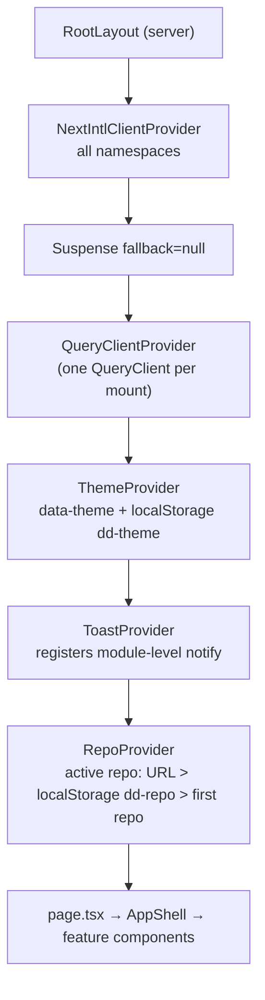
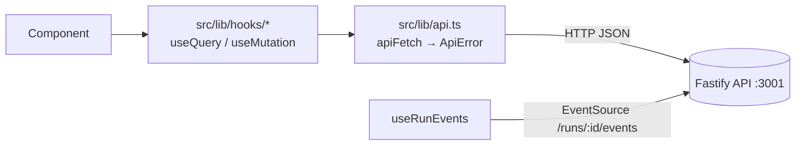

# UI architecture — `@devdigest/web`

How the studio is wired, from the root layout down to a single hook. Every claim cites the
file it comes from; when the code changes, update this page. Route-by-route behaviour lives in
[../specs/pages.md](../specs/pages.md).

## 1. Server vs Client boundary

Almost everything is a Client Component. The server side is deliberately tiny:

| Runs on the server | What it does |
|---|---|
| `src/app/layout.tsx` | Root layout (async RSC). Loads locale + messages, injects theme script, mounts providers. |
| `src/i18n/request.ts` | next-intl `getRequestConfig`: reads every `messages/en/*.json` from disk (`node:fs`) and merges them as `{ [namespace]: {...} }`. Wired in via `createNextIntlPlugin("./src/i18n/request.ts")` in `next.config.mjs`. |
| `src/app/agents/page.tsx`, `src/app/settings/[section]/page.tsx` | No `"use client"`: thin RSC entries that just render a client view (`AgentsListView`, `SettingsView`). |

Everything else that renders UI starts with `"use client"`: the other `page.tsx` files
(`/`, `/onboarding`, `/repos/[repoId]/pulls`, `/repos/[repoId]/pulls/[number]`, `/agents/[id]`),
all `_components/*`, all `src/components/*`, all `src/lib/hooks/*`, and the providers
(`providers.tsx`, `theme.tsx`, `toast.tsx`, `repo-context.tsx`).
No page fetches data on the server — all data comes from the browser through TanStack Query.

### What `app/layout.tsx` does (server)

1. `await getLocale()` / `await getMessages()` (`layout.tsx:15-16`) — single locale `en`, no locale routing (`src/i18n/request.ts:14`).
2. Renders `<html data-theme="dark" data-density="regular" suppressHydrationWarning>` and an inline
   `<script>` with `themeNoFlashScript` (`layout.tsx:21`, `src/lib/theme.tsx`) that reads
   `localStorage["dd-theme"]` and sets `data-theme` **before paint** (no flash of the wrong theme).
3. `<body suppressHydrationWarning>` — tolerates extension-injected attributes on `<body>` only.
4. Wraps children: `NextIntlClientProvider(locale, messages)` → `<Suspense fallback={null}>` → `<Providers>` (`layout.tsx:28-31`).
   The `Suspense` boundary is what lets client pages call `useSearchParams()`.

## 2. Provider stack (`src/lib/providers.tsx`)



**QueryClient defaults** (`providers.tsx:25-31`): `retry: 1`, `staleTime: 30_000`, `refetchOnWindowFocus: false`.

**Global error → toast policy** (`providers.tsx:32-43`):

| Source | Toasts when | Why |
|---|---|---|
| `QueryCache.onError` | `ApiError.status === 0` (network) or `>= 500` | Expected 4xx (e.g. 404) stay silent so pages can render inline empty/error states. |
| `MutationCache.onError` | always | Mutations are user actions — the user must see failure. |
| SSE `error` events | each `kind: "error"` event with a `msg` (`hooks/reviews.ts:189`) | Run failures arrive over SSE, never through the query cache. |

`notify` (`src/lib/toast.tsx`) is a module-level bridge so non-React code (the query cache, hooks)
can raise toasts; `useToast()` is the in-component API. Toasts auto-dismiss after 4 s.

**RepoProvider** (`src/lib/repo-context.tsx`) exposes `useActiveRepo()` (`repoId`, `repos`,
`activeRepo`, `reposLoaded`) and `useRepoNotFound(repoId)` — true only once repos have loaded and
the URL's `:repoId` matches none; repo-scoped pages then render `<RepoNotFound/>` instead of an error.

## 3. Data layer



### `src/lib/api.ts` — the only HTTP client

- Base URL `API_BASE = NEXT_PUBLIC_API_BASE ?? "http://localhost:3001"` (also defaulted in `next.config.mjs`).
- Sets `content-type: application/json` **only when a body is sent** (body-less POSTs would otherwise be rejected by Fastify).
- `ApiError { status, code?, details? }` taxonomy:
  - `status: 0`, `code: "network_error"` — fetch threw (API down) → toast / full-screen candidate (`api.ts:36`).
  - `status: 4xx/5xx` — message/code/details taken from the server's `{ error: { code, message, details } }` body when JSON (`api.ts:44-58`).
- `204` → `undefined`. Helpers: `api.get/post/put/patch/del`.

### Hooks (`src/lib/hooks/*`, barrel `index.ts`)

| File | Query keys | Notes |
|---|---|---|
| `core.ts` | `["settings"]`, `["secrets-status"]`, `["repos"]`, `["pulls", repoId]`, `["pull", prId]`, `["context", repoId]` | `usePulls` polls `refetchInterval: 60_000` and re-enables `refetchOnWindowFocus`. `useUpdateSettings` writes the cache via `setQueryData`. `useTestConnection` invalidates `provider-models` + `secrets-status` on success. `useRefreshRepo` invalidates `repos` + `["pulls", repoId]`. |
| `agents.ts` | `["agents"]`, `["agent", id]`, `["provider-models", provider]` | Create/update/delete invalidate `agents`; delete also `removeQueries(["agent", id])`. |
| `reviews.ts` | `["pr-active-runs", prId]`, `["pr-runs", prId]`, `["reviews", prId]`, `["pr-comments", prId]` | Active runs poll every 4 s **only while non-empty**; run history polls 4 s while any run is `running`. `useRunReview`/`useFindingAction` invalidate `reviews`; `useDeleteRun` invalidates `pr-runs` + `reviews`. |
| `trace.ts` | `["run-trace", runId]` | `retry: false`; `enabled` flag lets the drawer wait until a run finishes. |
| `repo-intel.ts` | `["repo-intel-state", repoId]` | Optional 1.5 s polling. Currently not used by any page. |

Conventions:
- Keys are `[resource, id]` tuples; invalidate by the same tuple after a mutation.
- PR APIs are keyed by the PR **uuid**, routes by PR **number** — the detail page resolves
  number → uuid through the cached `["pulls", repoId]` list (`pulls/[number]/page.tsx:33-36`).
- `["reviews", prId]` is shared between the PR list's findings popover and the PR detail page.

### Live runs — SSE (`useRunEvents`, `hooks/reviews.ts:168`)

Opens one `EventSource(${API_BASE}/runs/${runId}/events)` per run id, listens to `onmessage`
plus named events `info|tool|result|error`, appends parsed `RunEvent`s, and toasts on `error`.
`es.onerror` closes the stream; when all are closed `running` flips to `false`. Consumers
(`RunStatus`) treat that transition as "run done" and invalidate `pr-active-runs`, `pr-runs`, `reviews`.

## 4. Component organisation

```
src/app/<route>/page.tsx                 thin route entry (params, ?query, state switch)
src/app/<route>/_components/<Name>/      Name.tsx · index.ts · styles.ts · constants.ts · helpers.ts · Name.test.tsx
src/app/<route>/_components/<Name>/_components/<Child>/   nested private children
src/components/<kebab-name>/             cross-route shared: app-shell, page-shell, diff-viewer,
                                         run-cost-badge, severity-counts, repo-not-found, mermaid-diagram, showcase
src/lib/                                 api, hooks, providers, pure helpers (findings.ts, format-cost.ts, github-urls.ts …)
src/vendor/ui        (@devdigest/ui)     vendored design system: primitives, kit (Drawer, Tabs, Dropdown…), shell (AppFrame, Sidebar), icons, styles.css
src/vendor/shared    (@devdigest/shared) vendored Zod contracts + types
```

- Every page wraps its content in `<AppShell crumb=[...]>` (`src/components/app-shell/AppShell.tsx`):
  AppFrame + command palette (Cmd/Ctrl+K), `?` shortcuts help, `g`-then-key navigation
  (`hooks/useGlobalShortcuts.ts`). `/onboarding` is the exception (full-screen card).
- Path aliases (`tsconfig.json`, mirrored in `vitest.config.ts`): `@/*` → `src/*`,
  `@devdigest/ui` → `src/vendor/ui`, `@devdigest/shared` → `src/vendor/shared`.
  Older files still use long relative imports; both resolve.
- `src/lib/types.ts` re-exports contract types from `@devdigest/shared` — don't redefine them.
- **Contract drift:** `src/vendor/shared` is a copy of `server/src/vendor/shared` (canonical).
  `diff -rq` currently reports differences in `adapters.ts`, `contracts/eval-ci.ts`,
  `contracts/knowledge.ts`, `contracts/productionize.ts`, `contracts/trace.ts`. Any contract change → edit both.

## 5. i18n

- Messages: `messages/en/<namespace>.json`, one file per feature (`prReview`, `runs`, `agents`,
  `settings`, `shell`, `common`, …). Adding a file adds a namespace automatically (`src/i18n/request.ts`).
- Client usage: `useTranslations("<ns>")`. Server: `getTranslations("<ns>")`.
- Shared components in `src/components/*` read from **`common`** (`RunCostBadge`, `SeverityCounts`,
  `FindingsPopover`, `RepoNotFound`). Tests rendering them must pass `common` to `NextIntlClientProvider`.
- Not fully migrated: some screens still hardcode English (e.g. `pulls/[number]/page.tsx`,
  `PrDetailHeader`, `FindingsTab`, `agents/[id]/page.tsx`, `AddRepoView`). New text must go through messages.

## 6. Styling

- `src/app/globals.css` imports `src/vendor/ui/styles.css`, which pulls in Tailwind 4, defines the
  CSS-variable tokens per `[data-theme="dark"|"light"]` and maps them in `@theme inline`.
- Tokens used everywhere: `--bg-primary/-surface/-elevated`, `--text-primary/-secondary/-muted`,
  `--border`, `--accent`, `--crit`, `--warn`, `--ok`, `--stale`, `--code-add-text`, `--code-del-text`.
- Components style with **inline style objects** colocated in `styles.ts` (`export const s = {...}`,
  static objects `satisfies CSSProperties` or functions for state, e.g. `s.row(hover)` in
  `src/app/repos/[repoId]/pulls/styles.ts`). Colours always via `var(--token)`, never raw hex.
- Utility classes in use: `mono`, `tnum`.

## 7. Testing

- `vitest.config.ts`: `jsdom`, globals, `@vitejs/plugin-react`, `setupFiles: src/test/setup.ts`
  (jest-dom matchers + `ResizeObserver` stub), includes `src/**/*.test.{ts,tsx}`, `css: false`.
- No API needed: tests either `vi.mock` the hook module (e.g. `RunReviewDropdown.test.tsx`,
  `FindingsPanel.test.tsx`, `RunTraceDrawer.test.tsx`) or `vi.stubGlobal("fetch", …)` (`PRRow.test.tsx`).
  `next/navigation` is mocked where routing is used.
- Render helpers wrap components in `QueryClientProvider` (retry off) + `NextIntlClientProvider`
  with the real `messages/en/*.json` they need.
- Pure helpers have plain unit tests (`src/lib/findings.test.ts`, `src/lib/format-cost.test.ts`).
  `src/test/smoke.test.tsx` renders the component gallery in both themes. Browser journeys live in `../e2e`.
