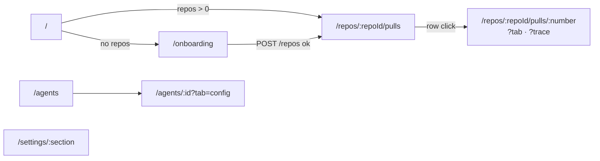

# Spec — Pages (behavioural contract per route)

What each `src/app/**/page.tsx` route reads, fetches, shows and does. This is the contract to
keep when changing a page; architecture is in [../docs/ui-architecture.md](../docs/ui-architecture.md).
Feature-level detail lives in its own spec — link, don't repeat:
- [run-cost-badge.md](run-cost-badge.md) — COST cell, run timeline cost, trace stats cost.
- [findings-severity.md](findings-severity.md) — FINDINGS cell + popover, Timeline counters, Review-run pills/filters.

All routes except `/onboarding` render inside `<AppShell crumb=[...]>` (sidebar, breadcrumbs,
Cmd/Ctrl+K palette, `?` help, `g`-then-key nav).

## Route map

| Route | File | Server/Client |
|---|---|---|
| `/` | `src/app/page.tsx` → `HomeView` | RSC entry, client view |
| `/onboarding` | `src/app/onboarding/page.tsx` → `AddRepoView` | RSC entry, client view |
| `/repos/:repoId/pulls` | `src/app/repos/[repoId]/pulls/page.tsx` → `PullsListView` | RSC entry, client view |
| `/repos/:repoId/pulls/:number` | `src/app/repos/[repoId]/pulls/[number]/page.tsx` | client |
| `/agents` | `src/app/agents/page.tsx` → `AgentsListView` | RSC entry, client view |
| `/agents/:id` | `src/app/agents/[id]/page.tsx` → `AgentEditorView` | RSC entry, client view |
| `/settings/:section` | `src/app/settings/[section]/page.tsx` → `SettingsView` | RSC entry, client view |

Every route also gets `app/error.tsx` (segment error boundary: `ErrorState` + Retry → `reset`),
`app/global-error.tsx` (root-layout failures; own `<html>`, static `common` strings) and
`app/not-found.tsx` (unknown URLs / `notFound()`; `NotFoundView` with a "Go to home" CTA).

---

## `/` — Home redirect
- **Data:** `useRepos()` → `GET /repos`.
- **States:** loading → skeletons · error **or** zero repos → `EmptyState` "No repositories yet" with CTA → `/onboarding` · repos present → `router.replace('/repos/<first>/pulls')` (an "Open <full_name>" button is shown meanwhile).

## `/onboarding` — Add repository
- **Data:** `useAddRepo()` → `POST /repos { url }` (invalidates `["repos"]`).
- **Interactions:** submit URL → on success navigate to `/repos/<id>/pulls`; on failure show the `ApiError` message inline (form error, plus the global mutation toast). `Esc` or ✕ → `/`. Link to `/settings/api-keys`.
- No AppShell (full-screen card).

## `/repos/:repoId/pulls` — PR list
- **Query params:** `?status` = `all | needs_review | reviewed | stale`; **default `needs_review`** when absent. Chip clicks always write `status` explicitly (so `all` sticks). Search text and sort (`newest`/`oldest` by `updated_at`) are **local state**, not in the URL.
- **Data:** `usePulls(repoId)` → `GET /repos/:id/pulls` (auto-refetch every 60 s + on window focus) · Refresh button → `useRefreshRepo` → `POST /repos/:id/refresh` · per-row lazy `usePrReviews` (only when the findings popover opens).
- **Header:** title + summary "{open} open · {needsReview} need review" (open = `needs_review|reviewed|stale`) and `AutoTriggerStatus` (off).
- **Filter bar:** search (title or `#number`), status chips (All / Needs review / Reviewed / Stale), sort select, Refresh (disabled + "Refreshing…" while pending).
- **Columns** (`constants.ts` `COLUMN_KEYS`, labels in `messages/en/prReview.json` `list.columns`, rendered upper-case):

| Column | Content (`_components/PRRow/PRRow.tsx`) |
|---|---|
| PULL REQUEST | PR icon coloured by status, title, `#number` |
| AUTHOR | avatar + login |
| SIZE | `S/M/L · lines`, lines = additions + deletions; S < 100, M < 400, else L |
| SCORE | `CircularScore` when `score != null`, else `—` (never reviewed) |
| FINDINGS | `FindingsSeverity` counters + popover → [findings-severity.md](findings-severity.md) |
| STATUS | badge: needs_review / reviewed / stale / open / merged / closed |
| COST | `RunCostBadge variant="compact"` of `pr.cost_usd` → [run-cost-badge.md](run-cost-badge.md) |
| UPDATED | relative time (`now`, `5m`, `3h`, `2d`, `—`) |

- **States:** unknown `:repoId` (repos loaded, no match) → `RepoNotFound` · loading → 4 skeleton rows · error → `ErrorState` (ApiError message) + Retry · no rows after filtering → `EmptyState` (body differs for `all` vs a specific status).
- **Interaction:** row click → `/repos/:repoId/pulls/:number`.

## `/repos/:repoId/pulls/:number` — PR detail
- **Query params:** `?tab` = `overview` (default) `| findings | diff`; `?trace=<runId>` opens the Run trace drawer. Both updated with `router.replace` (no history entries).
- **Data:**
  - `usePulls(repoId)` to resolve **number → PR uuid**, then `usePullDetail(prId)` → `GET /pulls/:id`.
  - `usePrReviews` → `GET /pulls/:id/reviews` · `usePrActiveRuns` → `GET /pulls/:id/runs/active` (polls 4 s while non-empty) · `usePrRuns` → `GET /pulls/:id/runs` (polls 4 s while any `running`).
  - Mutations: `useRunReview` `POST /pulls/:id/review` · `useCancelRun` `POST /runs/:id/cancel` · `useDeleteRun` `DELETE /runs/:id` · `useDeleteReview` `DELETE /reviews/:id` · `useFindingAction` `POST /findings/:id/(accept|dismiss)`.
- **States:** unknown repo → `RepoNotFound` · loading (pulls or detail) → skeletons · error or PR not found → full-screen `ErrorState` "Couldn't load this pull request" + Retry.
- **Header** (`PrDetailHeader`): `#number title`, author, `branch → base`, `+add −del`, status badge; "View on GitHub" (disabled until repo `full_name` known); **Run review ▾** (`RunReviewDropdown`: run all enabled agents, or any single agent incl. disabled; "Configure agents" → `/agents`; merged/closed PRs get a warning item + dimmed trigger and a banner, but running is still allowed). Starting a run switches to `?tab=findings` and invalidates active runs.
- **Tabs:**

| Tab label | `?tab` | Content |
|---|---|---|
| Overview | `overview` | PR description (`OverviewTab`); nothing if body is empty |
| Agent runs (count = total findings) | `findings` | `FindingsTab`, see below |
| Files changed (count = files) | `diff` | `DiffTab`: `DiffViewer` + GitHub inline comments (`GET/POST /pulls/:id/comments`); comments hidden by default with Show/Hide toggle; commenting only when `pr.status === "open"` |

- **Agent runs tab** (`FindingsTab`), top to bottom:
  1. **Live review** (when active runs exist): `RunStatus` streams SSE logs for all live run ids; **Cancel** (cancels every live run) and **Open run trace** (first live run). When the streams end (server's terminal `done`) → invalidate active runs + run history once, refetch reviews.
  2. "Review in progress…" banner while running · "Lethal Trifecta detected" banner when any finding has `kind === "lethal_trifecta"`.
  3. **Timeline** (`RunHistory`, when runs or commits exist): runs and commits merged newest-first. Run row = outcome badge (running/failed/cancelled/done), agent name (click → opens + scrolls to its Review-run accordion), failure error, severity counters, `RunCostBadge variant="detailed"`, Open trace (sets `?trace`), Delete (not while running; asks first in a `ConfirmDialog`).
  4. **Review runs**: one `ReviewRunAccordion` per review (newest first, first open): verdict, counts, score, time, `VerdictBanner` + `FindingsPanel` (severity pills/filters, "hide low confidence", `FindingCard`s with accept/dismiss; keyboard `j`/`k` move focus, `a` accept / `d` dismiss the focused finding). Empty → "No findings yet" (hidden while a run is live).

### Run trace drawer (`?trace=<runId>`)
- `RunTraceDrawer` (720 px `Drawer`), mounted by the page when `prId && ?trace`; close removes `?trace`.
- Title: agent name (from the matching review, else `trace.config.agent`); subtitle `PR #n · completed`.
- **Tabs:** **Trace** (default) and **Live log**. The page does not pass `running`, so the drawer always loads the persisted trace via `useRunTrace` → `GET /runs/:id/trace` (`retry: false`) and Live log shows the trace's stored log.
- **Trace sections** (`TraceBody`): Configuration (model, provider, memory pulled, specs read) · Stats (grounding badge, duration, tokens, cost, findings) · Findings (that run's persisted findings) · Prompt assembly (collapsed; system/skills/memory/… blocks) · Tool calls · Raw output.
- **States:** loading → "Loading trace…" · no trace (e.g. 404) → "No trace available yet." Footer: **Copy raw output** (disabled until loaded, shows "Copied!" for 1.5 s).

## `/agents` — Agents list
- **Data:** `useAgents()` → `GET /agents` · `useUpdateAgent` (enable toggle) `PUT /agents/:id` · `useCreateAgent` `POST /agents` · `useDeleteAgent` `DELETE /agents/:id` (from `AgentCard`).
- **States:** loading → skeletons · error → `ErrorState` + Retry · empty → `EmptyState`.
- **Interactions:** client-side search; **Add agent ▾** → "Create from scratch" or a template item (Security, Performance, Mentor, Conformance, Architecture — all currently just open the blank `CreateAgentModal`); after create → `/agents/:id?tab=config`; card click (the card is a link) → `/agents/:id?tab=config`; delete asks first in a `ConfirmDialog`.

## `/agents/:id` — Agent editor
- **Query params:** `?tab` — only `config` is valid; anything else falls back to `config`.
- **Data:** `useAgents()` (left list), `useAgent(id)` → `GET /agents/:id`, `useUpdateAgent`, `useProviderModels(provider)` → `GET /providers/:provider/models` (in `ConfigTab`).
- **States:** error or missing agent → full-screen `ErrorState` + Retry · loading → skeleton editor pane.
- **Interactions:** switch agent from the left list (keeps `?tab`), toggle enabled per card, edit config (name, description, model, system prompt, repo-intel, enabled) and save; "Run on a PR…" → `/`.

## `/settings/:section` — Settings
- **Path param:** `section` ∈ `SETTINGS_SECTIONS` (`src/vendor/ui/nav.ts`): `api-keys` (default) · `models`. Unknown sections → `notFound()` (the server page validates the param), rendering `app/not-found.tsx`.
- **API Keys** (`SettingsApiKeys`): `useSecretsStatus` → `GET /settings/secrets-status` (booleans only); per provider "Test connection" → `POST /settings/test-connection` (on success invalidates `provider-models` + `secrets-status`).
- **Feature Models** (`SettingsModels`): `useSettings` → `GET /settings`, `useUpdateSettings` → `PUT /settings`, model list from `useProviderModels("openrouter")`.
