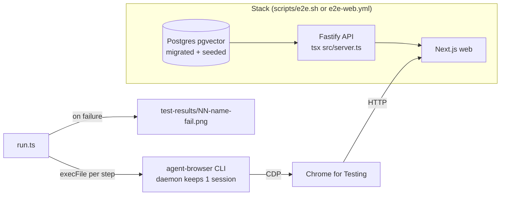
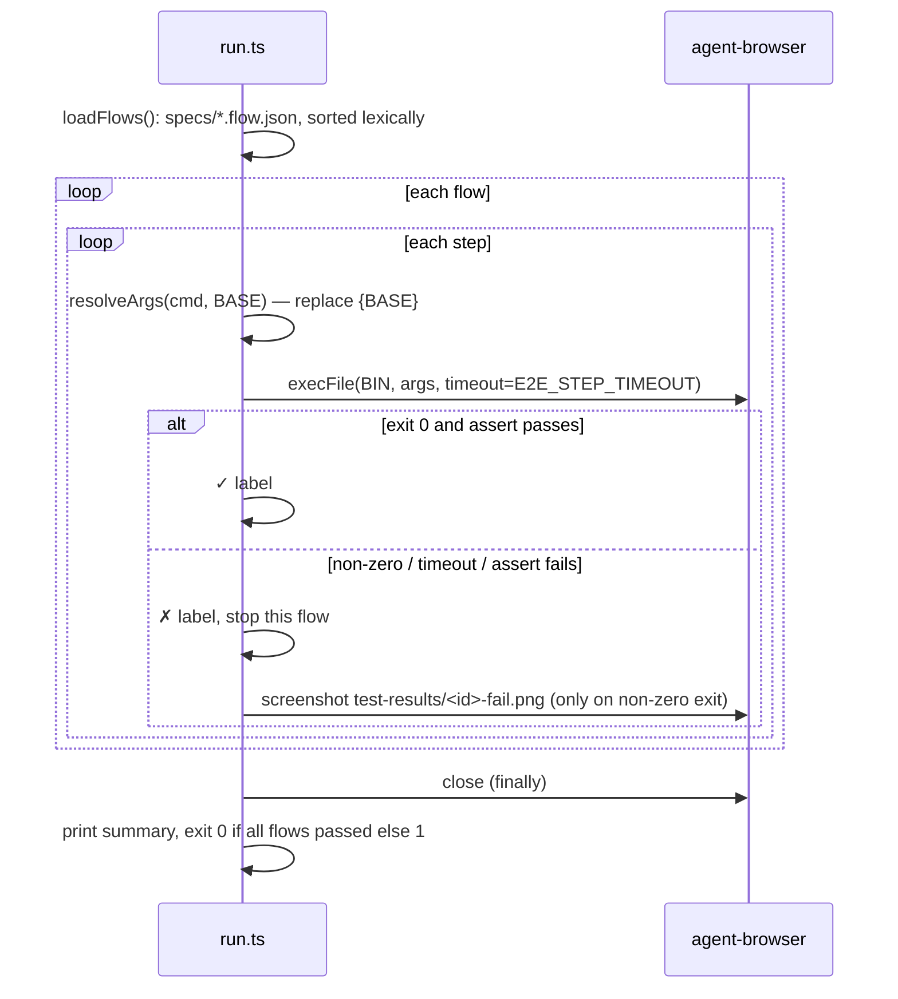

# e2e runner — how the suite works

The suite is two pieces: a **stack** (Postgres + seeded API + Next.js web) and a
**runner** (`run.ts`) that replays JSON flows through the
[agent-browser](https://github.com/vercel-labs/agent-browser) CLI. There is no
Playwright and no test framework. Pass/fail comes from command exit codes.



## 1. Starting the stack

### Hermetic, local (`scripts/e2e.sh`, run via `npm run e2e:hermetic`)

| Phase | What happens | Where |
|---|---|---|
| Config | Alt ports: PG `5433`, API `3101`, web `3100` (env `E2E_PG_PORT` / `E2E_API_PORT` / `E2E_WEB_PORT`; also `E2E_PG_CONTAINER`, `E2E_PG_IMAGE`, `E2E_PG_DB/USER/PASS`) | `scripts/e2e.sh:26-33` |
| Env export | `DATABASE_URL` on `127.0.0.1:$PG_PORT`, `API_PORT`, `WEB_PORT`, `NEXT_PUBLIC_API_BASE`, `E2E_BASE_URL` are exported **before** any spawn; dotenv does not override set vars, so `server/.env` values lose | `scripts/e2e.sh:40-43` |
| Prereqs | Requires `docker` + `pnpm`; missing `agent-browser` is only a warning. Helpers (`log`, `kill_tree`, `require_free_ports`) come from `scripts/lib.sh` | `scripts/e2e.sh:46-52` |
| Port preflight | Fails fast with the holder's PID/command if `$WEB_PORT`/`$API_PORT` are already listening — runs **before** the trap, so the trap's port backstop only ever kills what this script started | `scripts/e2e.sh:54-57` |
| Teardown trap | Installed before any spawn. On EXIT/INT/TERM: kill API + web process trees (leaves-first, since tsx/next listen in a grandchild), kill anything still listening on the alt ports, `docker rm -f` the container, remove the throwaway `$E2E_HOME` | `scripts/e2e.sh:59-82` |
| DB | `docker run --rm` with **no volume** → empty each run; waits up to 60 s for `pg_isready` health | `scripts/e2e.sh:86-104` |
| Deps | `pnpm install --frozen-lockfile` in `server`/`client` if `node_modules` missing; `npm ci` in `reviewer-core` (the API imports its raw source) and `e2e` | `scripts/e2e.sh:106-116` |
| Migrate + seed | Hard guard refuses unless `DATABASE_URL` is on `:$PG_PORT`; then `pnpm db:migrate` and `pnpm db:seed` | `scripts/e2e.sh:120-129` |
| API | `server/node_modules/.bin/tsx src/server.ts` (no build, no watcher) with **key isolation**: `HOME` → throwaway temp dir (no `~/.devdigest/secrets.json`), `env -u` of `OPENAI/ANTHROPIC/OPENROUTER_API_KEY`, `GITHUB_TOKEN/PAT` and any other `*_API_KEY`, and `DOTENV_CONFIG_PATH` → a nonexistent file so `dotenv/config` cannot refill them from `server/.env`; polls `/health` up to 60 s | `scripts/e2e.sh:131-158` |
| Web | `pnpm exec next dev -p $WEB_PORT`; polls the root up to 60 s | `scripts/e2e.sh:160-172` |
| Run | `cd e2e && npm test`; its exit code becomes the script's exit code | `scripts/e2e.sh:174-180` |

### CI (`.github/workflows/e2e-web.yml`)

CI does **not** use `e2e.sh`. It runs on push to `main` / PRs touching
`client/`, `server/`, `e2e/`, `reviewer-core/`, `scripts/` or the workflow. It uses the default ports
(`docker compose up -d` Postgres on 5432, API 3001, web 3000), migrates and seeds,
runs `pnpm build && pnpm start` for the web (production build, not `next dev`),
installs a pinned `agent-browser@0.39.0` with `install --with-deps`, then `npm ci`, `npm run typecheck`, `npm test`.
On failure it uploads `e2e/test-results/**` as the `e2e-failure` artifact.

### Against your own dev stack

`./scripts/dev.sh` then `cd e2e && npm test`. Only works if the DB holds **only**
the seeded repo (see determinism below).

## 2. How `run.ts` executes flows



- **Env** (`run.ts:39-41`): `E2E_BASE_URL` (default `http://localhost:3000`),
  `AGENT_BROWSER_BIN` (default `agent-browser`), `E2E_STEP_TIMEOUT` ms (default `60000`).
- **Discovery** (`run.ts:53-61`): every file in `specs/` ending in `.flow.json`,
  sorted by filename; the `NN-` prefix sets the order. No filter/grep option exists — all flows always run.
- **Execution** (`run.ts:44-51`): each step is one `execFile` call, `cwd` = `e2e/`
  (so `agent-browser.json` there is picked up: headless, no HTTPS-error ignore),
  32 MB stdout buffer. Steps share one browser session; the agent-browser daemon
  keeps the page between calls, so flows also share state (each flow begins with `open`).
- **Fail-fast per flow, not per suite** (`run.ts:68-89`): the first failing step
  breaks out of that flow; the next flow still runs.
- **Teardown** (`run.ts:108-111`): `agent-browser close` in `finally`, errors ignored.
- **Exit** (`run.ts:114`): `0` only when every flow is ok; a crash prints
  `e2e runner crashed: …` and exits `1` (`run.ts:117-120`). Zero specs found → exit `1`.

## 3. Flow and step format

Types live in `lib/assert.ts:9-22`.

```jsonc
{
  "name": "Human flow name",            // required, printed and used in the summary
  "description": "Why/what (optional)", // not read by the runner — documentation only
  "steps": [
    {
      "cmd": ["wait", "--text", "#482"],  // required: argv passed verbatim to agent-browser
      "label": "seeded PR visible",       // optional; defaults to cmd joined by spaces
      "assert": { "stdoutIncludes": "x" } // optional; substring check on stdout
    }
  ]
}
```

`{BASE}` in any arg is replaced with `E2E_BASE_URL`, trailing slashes trimmed
(`lib/assert.ts:37-40`). Files are parsed with `JSON.parse` and validated by `parseFlow` (`lib/assert.ts`,
hand-written — no zod dep): a missing `name`, zero steps, an empty/non-string `cmd`
or any unknown key (e.g. `asert`) aborts the run with every problem listed.

### Step vocabulary

The runner implements **no actions of its own**; anything agent-browser accepts is
valid. The vocabulary below is what the flows actually use and what conventions allow
(deterministic locators only, never the AI `chat` command):

| Purpose | `cmd` shape | Fails when |
|---|---|---|
| Navigate | `["open", "{BASE}/path"]` | navigation errors |
| Wait for network idle | `["wait", "--load", "networkidle"]` | not idle before timeout |
| Assert URL | `["wait", "--url", "<substring>"]` e.g. `"/pulls/482"`, `"tab=findings"` | URL never matches |
| Assert text | `["wait", "--text", "<visible text>"]` | text never appears |
| Click by text | `["find", "text", "<text>", "click"]` | no match |
| Click by role | `["find", "role", "button", "click", "--name", "<accessible name>"]` | no match |
| Screenshot | `["screenshot", "<path>"]` | used by the runner itself on failure |

Runner-level assertion: only `assert.stdoutIncludes` (`lib/assert.ts:15`,
`run.ts:73`). In practice no current flow uses it — every assertion is a `wait`
whose timeout makes agent-browser exit non-zero.

## 4. Reporting failures

- Live log per step: `✓ <label>` or `✗ <label> — <first line of error>` /
  `✗ <label> — assertion failed` (`run.ts:75-83`).
- Final summary (`lib/assert.ts:46-58`): `PASS|FAIL  <flow name>`, failed step with
  detail, then `N/M flows passed`.
- Screenshot: on a command error (not on a `stdoutIncludes` mismatch) the runner
  best-effort saves `e2e/test-results/<NN-name>-fail.png` (`run.ts:85-86`).
  `test-results/` is git-ignored; CI uploads it.

## 5. Determinism rules

- **No LLM call.** Flows only read seeded data and never submit a review/run. The API
  boots without keys because provider keys are not part of the config schema
  (`server/src/platform/config.ts:9-14`). `e2e.sh` additionally starts the API with
  no keys at all (temp `HOME`, keys unset, `.env` not loaded — see the API row above).
  CI likewise sets no keys.
- **Seeded data** (`server/src/db/seed.ts`): repo `acme/payments-api`, PR #482
  "Add rate limiting to public API endpoints" with file `src/config.ts`, a
  `request_changes` review with finding "Hardcoded Stripe secret key in commit",
  and agents including "Security Reviewer".
- **Single-repo precondition.** The home page redirects to `repos[0]`
  (`client/src/app/page.tsx:15-18`); flows 02/04/05 assume that is the seeded repo.
  The hermetic DB and CI's fresh DB guarantee this; a normal dev DB usually doesn't.
- **Deterministic locators** only: `wait --url|--text|--load`, `find text|role`.
- **Read-only:** no form submits, no imports/clones (flow 06 renders the form only).

## 6. Adding a new flow

1. Pick the next number: `specs/08-<name>.flow.json` (lexical order = run order).
2. Start with `open {BASE}/…`; never rely on state from the previous flow.
3. After navigation, `wait --url`, then `wait --load networkidle` where data is fetched,
   then `wait --text` for each visible fact you assert. Give every step a `label`.
4. Only use seeded data; if you need new data, extend `server/src/db/seed.ts` (a server change).
5. Use text that the UI really renders (check `client/messages/en/*.json` or the component).
6. Add a row to the coverage table in `README.md` and a section to [`../specs/flows.md`](../specs/flows.md).
7. Run `npm run typecheck` and `npm run e2e:hermetic`.
