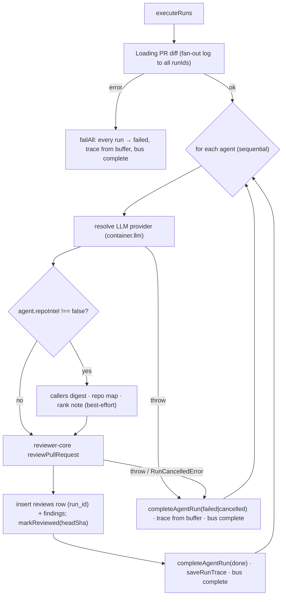
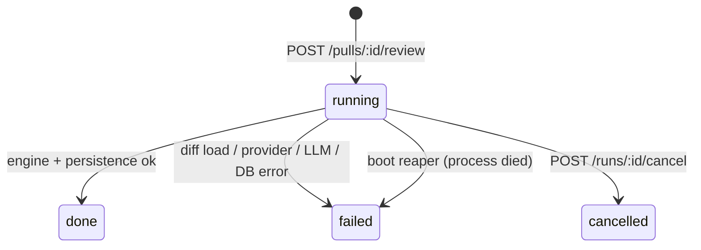

# Spec — Review flow (run lifecycle & endpoints)

Status: implemented (describes current behaviour) · Module: `src/modules/reviews/`
Related: [run-cost-badge.md](run-cost-badge.md) (tokens/`cost_usd` per status) ·
[findings-severity.md](findings-severity.md) (PR-list severity rollup) ·
[../docs/architecture.md](../docs/architecture.md) (boot, DI, error envelope).

Behavioural contract of one review cycle: trigger → background run per agent → persisted review +
findings → observability rows → reads. Code is the source of truth; line refs are to `src/`.

## 1. Trigger — `POST /pulls/:id/review`

`modules/reviews/routes.ts:27-44` → `ReviewService.resolveTargets` + `runReview` (`service.ts`).

- Params: `id` = PR uuid (`IdParams`, else 422). Rate limit **10/min** per route.
- Body (`RunRequest`, `contracts/platform.ts:270`, parsed manually; empty body allowed):
  - `{ "agentId": "<uuid>" }` → that agent only (404 `Agent not found` if not in the workspace);
  - `{ "all": true }` → every agent with `enabled = true` in the workspace (may be zero);
  - neither → **400** `invalid_run_request` (`Provide agentId or all:true`).
- PR not in workspace → 404; its repo missing → 404.
- For each target, an `agent_runs` row is inserted **before** responding
  (`status='running'`, `source='local'`, `provider`/`model` copied from the agent).
- Response (immediate, no LLM work yet):

```json
{ "pr_id": "<prId>", "runs": [{ "run_id": "<agent_runs.id>", "agent_id": "…", "agent_name": "…" }], "reviews": [] }
```

- Execution is fire-and-forget (`void executor.executeRuns(...)`); a crash of the whole background
  task is only logged. The client follows progress via SSE and refetches on `done`.

## 2. Background executor — `modules/reviews/run-executor.ts`



1. **Diff loading (once for all agents)** — `diff-loader.ts`: `container.git.diff(repo, pull.base,
   pull.headSha)`; if it throws or returns no files, rebuild a unified diff from persisted
   `pr_files.patch` rows. Failure here fails **every** queued run (`failAll`, executor `:78-107`).
2. **Agents run sequentially**; one agent's failure does not stop the others (`:111-138`).
3. **Provider** — `container.llm(agent.provider)`; a missing key throws `ConfigError` → run `failed`.
4. **Repo-intel context** (skipped entirely when `agent.repoIntel === false`; each piece swallows
   its own errors and logs an `info` line):
   - callers digest — `repoIntel.getCallerSignatures(repoId, changedFiles, 10)`, grouped by file;
   - repo map — `repoIntel.getRepoMap(repoId)`, omitted if `degraded` or empty;
   - rank note — appended to the task line when changed files have `percentile >= 95`.
   Unindexed repo / `REPO_INTEL_ENABLED=false` → all omitted → diff-only prompt.
5. **Engine** — `reviewPullRequest` (`reviewer-core/src/review/run.ts`) with `systemPrompt`,
   `model`, `diff`, `strategy: agent.strategy ?? 'single-pass'` (`constants.ts`), optional
   `callers`/`repoMap`/`prDescription` (PR body), `task` (`helpers.ts` `taskLine` + rank note),
   `sessionId = owner/name#number:agentName`, and callbacks `onEvent` (→ run log), `onUsage`
   (running token/cost totals), `checkCancelled` (throws `RunCancelledError`).
   Inside the engine: one structured call per chunk (single-pass = 1 chunk; map-reduce = 1 per
   file), reduce, then **grounding** (`groundFindings`: findings citing lines not in the diff are
   dropped; summary `"<kept>/<total> passed"`), then **score** recomputed as
   `scoreFromFindings(kept)` — the model's score is ignored; the model's verdict is kept.
6. **Persistence** — `insertReview({ kind:'review', agentId, runId, verdict, summary, score,
   model })` + `insertFindings(review.id, kept)`; then `pull_requests.last_reviewed_sha = headSha`.
   `reviews.run_id` is a plain uuid column **without FK** to `agent_runs` (`db/schema/reviews.ts:19`).
7. **Blockers** — `countBlockers(kept, agent.ciFailOn)` (severity ≥ the agent's gate; `never` → 0).

## 3. `agent_runs` lifecycle (`db/schema/runs.ts`, `repository/run.repo.ts`)



Fields written by `completeAgentRun` (`status` is overwritten unconditionally):

| Field | `done` | `failed` / `cancelled` (agent step) | pre-work failure | boot reaper |
|---|---|---|---|---|
| `duration_ms` | elapsed | elapsed | 0 | untouched |
| `tokens_in/out`, `cost_usd` | engine totals | partial (`onUsage`) — see [run-cost-badge.md](run-cost-badge.md) | 0, 0, NULL | untouched |
| `findings_count` | kept findings | 0 | 0 | untouched |
| `grounding` | e.g. `3/4 passed` | `0/0 passed` | `0/0 passed` | untouched |
| `score` | recomputed 0–100 | NULL | NULL | untouched |
| `blockers` | `countBlockers` | NULL | NULL | untouched |
| `error` | NULL | error message / `Cancelled by user` | `Failed to load PR diff: …` | untouched (NULL) |

Write failures in the failure path are swallowed (`.catch(() => undefined)`).

## 4. Run trace — `run_traces` (one jsonb doc per run, PK/FK `run_id`, cascade delete)

Upserted by `saveRunTrace`. Shape = `RunTrace` (`contracts/trace.ts:73`):
- success: `config` (agent, version, provider, model, pr, `source:'local'`), `stats` (duration,
  tokens, `cost_usd`, findings, grounding), `prompt_assembly` (from the engine), `tool_calls` (one
  `review_file` per chunk, average ms), `raw_output`, `memory_pulled: []`, `specs_read: []`, `log`
  (full RunBus buffer incl. shared diff pre-work);
- failure/cancel: minimal trace from the buffer — system prompt only, empty `tool_calls` /
  `raw_output`, partial usage, `findings: 0`.

`GET /runs/:id/trace` returns the stored doc cast (not re-parsed) or **404** `Run trace not found`.
Not workspace-scoped. Fields added to `RunTrace` later must be `.nullish()`.

## 5. Live events — `GET /runs/:id/events` (SSE)

- `RunBus` (`platform/sse.ts`) is an **in-memory, per-process** singleton: per run an emitter, a
  replay buffer and a `seq` counter. `RunEvent = { runId, seq, kind, msg, t (HH:MM:SS), data? }`,
  `kind ∈ info | tool | result | error`.
- The route replays the buffer, then streams live; each SSE message is
  `id = seq`, `event = kind`, `data = JSON(RunEvent)`. When the run is completed
  (`runBus.complete`), including for late subscribers of a completed run, the stream sends a
  terminal `event: done` (`data = {runId}`) and ends — clients close on it instead of letting
  EventSource auto-reconnect. No `done` on client abort or server shutdown. No rate limit.
- Unknown run, or a run of another workspace → **404** (`service.runExists`). A run this process no
  longer holds (evicted, or finished before a restart) ends immediately if it has a stored trace;
  a known run with no events yet ends after a 30 s grace instead of hanging.
- Client disconnect aborts the wait and unsubscribes. A completed run's buffer is evicted 5 min
  after `complete`. Events are lost on restart, so use `/runs/:id/trace` for history.

## 6. Cancel — `POST /runs/:id/cancel` → `{ ok: true }`

`ReviewService.cancelRun`: publish an info event, set the cancel flag, `UPDATE … SET
status='cancelled' WHERE status='running'` (no-op otherwise), then complete the bus. Works for
orphaned runs too. The live runner only notices at `checkCancelled`, i.e. **before each LLM chunk**;
in single-pass mode an in-flight LLM call is not interrupted, and if it finishes the run is then
written as `done` (status overwrite). Not workspace-checked beyond `getContext`.

## 7. Delete

- `DELETE /runs/:id` → `{ ok: boolean }` (no 404): deletes `reviews` with that `run_id` (findings
  cascade), then the `agent_runs` row (trace cascades). Workspace-scoped.
- `DELETE /reviews/:id` → `{ ok: true }` or 404: deletes one review + findings; its `agent_runs`
  row stays.

## 8. Finding actions — `POST /findings/:id/accept` · `POST /findings/:id/dismiss`

`findings.ts`: finding → review → PR must be in the workspace, else 404. `accept` sets
`accepted_at = now, dismissed_at = NULL`; `dismiss` the reverse (mutually exclusive, last action
wins). Response `{ finding: ReviewDtoFinding }`. `FindingActionKind` also lists `learn`/`reply`
but no route exists for them in the starter.

## 9. Read endpoints

| Endpoint | Returns |
|---|---|
| `GET /pulls/:id/runs` | `RunSummary[]` — every `agent_runs` row for the PR, any status, newest `ran_at` first, joined with agent name (`contracts/trace.ts:96`). |
| `GET /pulls/:id/runs/active` | `{ run_id, agent_id, agent_name, ran_at }[]` for `status='running'`. |
| `GET /pulls/:id/reviews` | `ReviewDto[]` (`helpers.ts reviewToDto`): all reviews of the PR (any kind, incl. seeded agent-less ones), newest first, each with `run_id`, `agent_name`, findings. 404 if PR not in workspace. |
| `GET /runs/:id/trace` | see §4. |

Severity rollups on the PR list: [findings-severity.md](findings-severity.md).
Cost/tokens semantics: [run-cost-badge.md](run-cost-badge.md).

## Tests

`test/reviews.it.test.ts` (DB-backed, mocked LLM via container overrides), `test/grounding.test.ts`,
`test/reviews-helpers.test.ts`, `test/helpers/runs.ts`.
